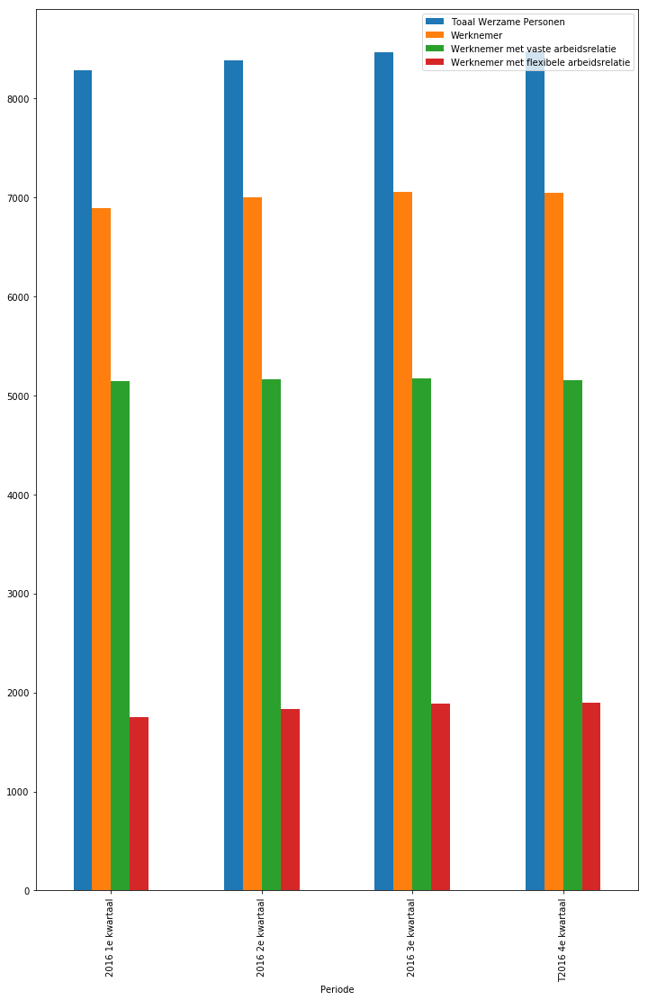
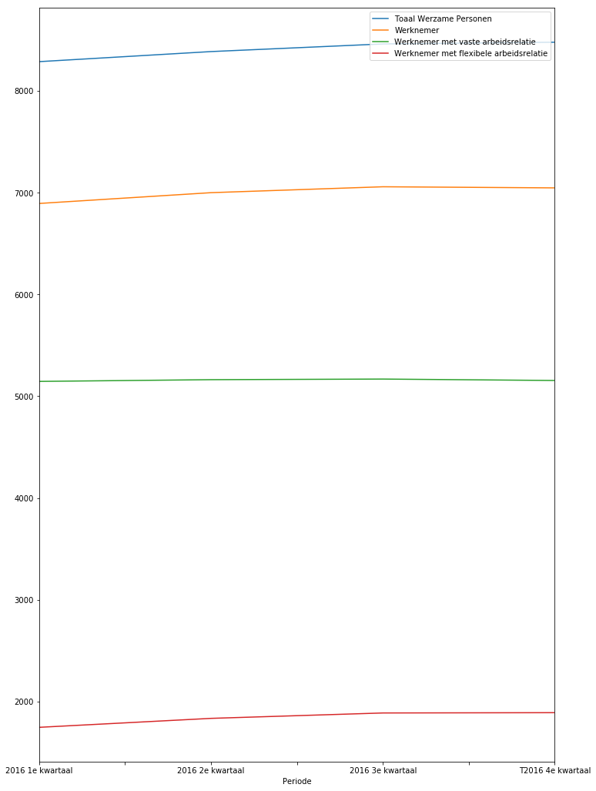

#

.. raw:: html

   

Battle of the contracts: Employment in the modern economy

.. raw:: html

   

+----------------+----------+
| Name           | ANR      |
+================+==========+
| Angel Rousev   | 582598   |
+----------------+----------+

##

.. raw:: html

   

Question

.. raw:: html

   

.. raw:: html

   

***Do temporary contracts harm employment?***

.. raw:: html

   

##

.. raw:: html

   

Motivation

.. raw:: html

   

.. raw:: html

   

::

    EAnyone between the ages of 15 and 65, is considered to be part of the national labor force. On employment, they face economic cycles and different legal amendments, which contribute to the employment figures and the state of employment contracts.  [The latest trend](https://observatoriosociallacaixa.org/documents/22890/80956/ART6_ENG_Graph1.jpg/3605c46d-3bff-4765-bc26-9d8a438fa156?t=1473783305328 "Wordwide Laborcontract Trend") shows a rise in flexible/temporary contracts. This in term causes the number of permanent contracts to go down, which deceases stability in the job market.  Does this help society to will this prevent more and more employees to garner any form of permanent contract, thus hurting employment?  

##

.. raw:: html

   

Brief introduction

.. raw:: html

   

.. raw:: html

   

::

    In the first part, the impact on the labor market due to the change in contracts will be examined. This will cover the institution and the effects on policy. Second will be the latest situation in The Netherlands with regard to the change in contracts. In the third part, the motion of a new policy, will be discussed. This will include the state of the motion and the residuum of that motion.          

##

.. raw:: html

   

Data

.. raw:: html

   

.. raw:: html

   

The transformed national data will be recovered from `CBS's
Statline <http://statline.cbs.nl/StatWeb/publication/?VW=T&DM=SLNL&PA=70072ned&D1=0-118&D2=0,12&D3=14-15&HD=100914-1525&HDR=T&STB=G1,G2>`__
The notebook will further cover theory and policy implications derived
from the data and trends within the labor market

.. raw:: html

   

##

.. raw:: html

   

Theory of institution

.. raw:: html

   

.. raw:: html

   

This part will cover the theory about the EPL, the Employment Protection
Legislation 1\*

The EPL is a system of procedure which protects employees from premature
job-loss, i.e. getting fired. It covers temporary/flexible contracts,
permanent contracts and collective dismissal in a macro causal domain.
The EPL is measured as an indication which is a sum of the weighted
averages of said indicators. For example, in the case of severance pay
as shown below.

.. raw:: html

   

.. raw:: html

   

.. math:: Severance Pay Indicator = {(9Months Tenure + 4Years Tenure + 20Years Tenure)/3)}

.. math:: Severance Pay Indicator = {(a + b + c)/3)}

.. math:: {With ((a,b,c)| ϵ  0,1,2,3,4,5,6))}

 Click
`here <https://www.oecd.org/els/emp/EPL-Document-LAC-Methodology-ENG.pdf>`__
to see the full list of the official EPL indicators.

.. raw:: html

   

.. raw:: html

   

In figure 1, you can see the Netherlands having a higher than average
permanent contract rate. This provides employees with job security. In
the next part, the decline in permanent contracts will be shown. This
trend has financial benefits for the employers and takes bargaining
power away from employees. The shortcoming of the EPL, besides the fact
that it is based on a survey, states nothing about actual enforcement of
a dismissal.

.. raw:: html

   

.. raw:: html

   

.. raw:: html

   

Figure 1

.. raw:: html

   

|EPL index for permanent and temporary work contracts in 2013 and 2008.
(EC.Europa, 2015)|

.. raw:: html

   

.. |EPL index for permanent and temporary work contracts in 2013 and 2008. (EC.Europa, 2015)| image:: https://image.ibb.co/mCPxMk/11.png

.. raw:: html

   

Figure 2 shows a negative correlation between the transition or
temporary/flexible workers to a permanent contract. Figure 3 further
illustrates the GDP-relationship as it pertains to the labor contracts,
which does not match previous EPL-statistics, meaning that the economy
is forcing the rise of temporary/flexible contracts.

.. raw:: html

   

.. raw:: html

   

.. raw:: html

   

Figure 2

.. raw:: html

   

|Ehare of temporary contracts (2013) and transition from temporary to
permanent (2012). (EC.Europa, 2015)|

.. raw:: html

   

.. |Ehare of temporary contracts (2013) and transition from temporary to permanent (2012). (EC.Europa, 2015)| image:: https://image.ibb.co/ip2C45/12.png

.. raw:: html

   

.. raw:: html

   

Figure 3

.. raw:: html

   

|Share of involuntary part-time workers on total part time workers (2013
and 2012), and part-time workers (% on total employment, 2013).
(EC.Europa, 2015)|

.. raw:: html

   

.. |Share of involuntary part-time workers on total part time workers (2013 and 2012), and part-time workers (% on total employment, 2013). (EC.Europa, 2015)| image:: https://image.ibb.co/jbVtBk/13.png

.. raw:: html

   

There is also a phenomenon called the Honeymoon effect, which states
that some flexibility serves as a buffer of the temporary/flexible
contracts to replace permanent contracts. The next part of the notebook
will focus on the employment on a national level and will display the
evolution of the labor contracts within The Netherlands

.. raw:: html

   

##

.. raw:: html

   

Empirical Evidence In The Netherlands

.. raw:: html

   

.. raw:: html

   

This part will illustrate the labor contracts and the labor market in
The Netherlands. Figure 3 shows the distribution of labor contracts in
The Netherlands. Figure 4 represents the dataset as presented from the
CBS.

::

    

.. raw:: html

   

.. raw:: html

   

Figure 3

.. raw:: html

   

|Dutch Labor Contracts 2001-2013|

.. raw:: html

   

.. |Dutch Labor Contracts 2001-2013| image:: http://recruitmentmatters.nl/wp-content/uploads/2013/10/image93.png

.. raw:: html

   

.. raw:: html

   

Figure 4

.. raw:: html

   

.. code:: ipython3

    import pandas as pd
    import matplotlib.pyplot as plt
    import matplotlib.dates as mdates
    %matplotlib inline
    
    data = pd.read_csv('datasets/datasets/12.csv', usecols=['Periode','Toaal Werzame Personen','Werknemer','Werknemer met vaste arbeidsrelatie','Werknemer met flexibele arbeidsrelatie'], parse_dates=['Periode'])
    
    data.set_index('Periode',inplace=True)
    
    fig, ax = plt.subplots(figsize=(12,18))
    data.plot(kind='bar', ax=ax)

.. parsed-literal::

    <matplotlib.axes._subplots.AxesSubplot at 0x23d16e3de48>

.. raw:: html

   

::

               The main law in The Netherlands that covers the labor contracts is ‘’De Wet Flexibiliteit en Zekerheid’’, also known as De Flexwet. Introduced in 1999, this law was meant to balance flexibility and job-security, thus creating stability within the power relationship of the employer and the employee. The law states that there can only be three temporary contracts offered within a span of three years. After the three-year period, the temporary/flexible contract automatically becomes a permanent contract.

2015 was the year where new additions to De Flexwet were added. These
were created to fight the increasing gap between both labor contracts.
The law now stated that the change from a temporary/flexible contract to
a permanent contract could be prevented if there was a period of six
month in-between both contracts. Another key addition was the
transformation from a temporary/flexible contract to a permanent
contract, if an individual worked over 2 years. This would become a
major issue, due to the countermeasure that was, firing the employee
before the 2-year threshold was reached. The CNV counted 200 cases in
2015 of these scenarios in The Netherlands. The same held true for the
six-month threshold. Minister Asscher proposed a second change in 2015
where a ‘’transitievergoeding’’ was granted to employees, with contract
terminations after the 2-year threshold. This would entail a one-third
payment of their ex-wage and one-half if total tenure was under ten
years, with a max of 76000 euros. A full wage would be paid for
employees over 50, no matter the employment duration. Thus, De Flexwet
is having the opposite effect and is damaging employees’’ chances. This
rise can be seen in figure 3 and in the following CBS dataset.

.. raw:: html

   

##

.. raw:: html

   

Policy Analysis

.. raw:: html

   

.. raw:: html

   

The EPL seems to cause work-arounds to occur more often and make
employers focus on a new time stamp for their employees’ termination.
Thus, it becomes clear that further and better protection is needed to
cover the employees against these measures. In The Netherlands, income
is guaranteed in some form when the worst scenario tends to occur, but
job security is not tackled in the slightest. This would probably cause
a rift between the principal and agent in this scenario, leading to less
effort and investment from the now, anticipation employee. A scenario
could also form where the buffer and the seasonal and cyclical changes,
return to the original state. This would make it optimal for employers
not to fire their employees as it will save several costs, including
searching costs and loss on investment.

An increase in the EPL causes fewer hiring’s. One of the countries that
has countered this problem in a way was Austria, which in 2003 replaced
their dismissal payment system, which was based on tenure. Now employees
have to pay a percentage of the payroll, which becomes a savings-account
for the employee. This procedure ends when the contract comes to an end.
This will serve as an income transfer measure when the contract would be
terminated. If no such scenario would occur, the funds would transfer to
the retirement fund of said individual.

A great policy would be a form of tenure, where employees experience
trust and safety in combination with the Austrian legislature amendment
of 2003. This form of EPL has less negative effects to ones with a
permanent contract and will clear up the 3-year threshold as seen in The
Netherlands. Partial reforms could provoke create labor market
dualities, thus a full reform would be beneficial.

.. raw:: html

   

##

.. raw:: html

   

Conclusion

.. raw:: html

   

.. raw:: html

   

A change in policy is needed. Europe and The Netherlands in particular
is facing job security threats from institutional loopholes. Thresholds
are being broken and even retirement policies have been subjugated to
these offenses (A diff-in-diff analysis of the effects on pension when a
certain birthrate was applied as a treatment threshold). In order to
make these preventive events happen a similar policy like in Austria has
to be implemented, which creates a form of insurance for both parties.
Governments fail to anticipate these events and employees should be
trapped in a vortex of temporary/flexible contracts. One has the right
to build up their career and be invested in the company in which they
function. I’m afraid that training and investment will become
meaningless and a job will become just a job for most.

::

    

 1\*

.. raw:: html

   

 Employment Practices Liability is an area of United States law that
deals with wrongful termination, sexual harassment, discrimination,
invasion of privacy, false imprisonment, breach of contract, emotional
distress, and wage and hour law violations. Employment Practices
Liability is part of professional liability.

.. raw:: html

   

##

.. raw:: html

   

References

.. raw:: html

   

Jenifer Ruiz-Valenzuela, (2016, September) Temporality, loss of work and
educational performance. Centre for Economic Performance, London School
of Economics. Retrieved from
https://observatoriosociallacaixa.org/en/article/-/asset\_publisher/ATai9MyKZiYq/content/el-impacto-de-la-temporalidad-y-la-perdida-de-trabajo-parental-en-el-rendimiento-educativo-de-los-hijos/pop\_up
Jabob, A. (2013). ‘’The Effect of Employment Protection on Teacher
Effort’’. Journal of Labor Ecocomics, 31(4): 727-761

Schnalzenberger, M. and Winter-Ebme, R. ‘’Layoff tax and employment of
the elderly’’. Labor Economics, 16(6): 618-624

Olsson, M. (2009). ‘’Employment protection and sickness absence’’. Labor
Economics, 16(2): 208-214 Employment protection legislation. (2015)
Retrieved from
http://ec.europa.eu/europe2020/pdf/themes/25\_employment\_protection\_legislation\_02.pd

Wijzigingen Flexwet 2015. (2015) Retrieved from
http://www.payrolltoday.nl/uploads/pdf/WIJZIGINGEN\_FLEXWET\_2015.pdf

Drees, M. (2013) De flexibele schil in beeld. Retireved from
http://recruitmentmatters.nl/2013/10/24/de-flexibele-schil-in-beeld-2/

Driessen, M. and Lautenbach, H. (2012, December 12). Minder Werknemers
Met Een Vast Conctract. CBS. Retrieved from
https://www.cbs.nl/nl-nl/nieuws/2012/50/minder-werknemers-met-een-vast-contract

Limmen, M. (2015, May 6) Werkgevers omzeilen www door flexkrachten te
ontslaan. CNV. Retrieved from
https://www.cnv.nl/actueel/nieuws/nieuwsdetail/werkgevers-omzeilen-wwz-door-flexkrachten-te-ontslaan/?L=0%2F&cHash=536a52bf52d90cf189cce000cee110ae

Driessen, M. (2015, November 13) Positie werkkring en arbeidsduur:
aantal vaste werknemers niet verder gedaald. CBS. Retrieved from
https://www.cbs.nl/nl-nl/achtergrond/2015/46/positie-werkkring-en-arbeidsduur-aantal-vaste-werknemers-niet-verder-gedaald

OECD (2004) OECD Employment Outlook 2004. ISBN: 9789264108134 (PDF)
;9789264108127(print). DOI: 10.1787/empl\_outlook-2004-en Retrieved from
http://www.oecd-ilibrary.org/employment/oecd-employment-outlook-
2004\_empl\_outlook-2004-en Regionale kerncijfers Nederland. (2017)
Retrieved from
http://statline.cbs.nl/Statweb/publication/?DM=SLNL&PA=70072ned&D1=0-118&D2=0,12&D3=14-15&HDR=T&STB=G1,G2&VW=C

##

.. raw:: html

   

Code

.. raw:: html

   

.. code:: ipython3

    # import modules
    import pandas as pd

.. code:: ipython3

    # Import the excel file and call it xls_file
    xls_file = pd.ExcelFile('datasets/datasets/examples.xls')
    xls_file

.. parsed-literal::

    <pandas.io.excel.ExcelFile at 0x23d16843cf8>

.. code:: ipython3

    # View the excel file's sheet names
    xls_file.sheet_names

.. parsed-literal::

    ['Werkzame_beroepsbev._3008172034', 'Omschrijving']

.. code:: ipython3

    # Load the xls file's Sheet1 as a dataframe
    df = xls_file.parse('Werkzame_beroepsbev._3008172034')
    df

.. raw:: html

    

    
    <table border="1" class="dataframe">
      <thead>
        <tr style="text-align: right;">
          <th></th>
          <th>Werkzame beroepsbevolking; positie in de werkkring</th>
          <th>Unnamed: 1</th>
          <th>Unnamed: 2</th>
          <th>Unnamed: 3</th>
          <th>Unnamed: 4</th>
          <th>Unnamed: 5</th>
          <th>Unnamed: 6</th>
          <th>Unnamed: 7</th>
        </tr>
      </thead>
      <tbody>
        <tr>
          <th>0</th>
          <td>NaN</td>
          <td>Onderwerpen</td>
          <td>Werkzame beroepsbevolking</td>
          <td>Werkzame beroepsbevolking</td>
          <td>Werkzame beroepsbevolking</td>
          <td>Werkzame beroepsbevolking</td>
          <td>Werkzame beroepsbevolking</td>
          <td>Werkzame beroepsbevolking</td>
        </tr>
        <tr>
          <th>1</th>
          <td>NaN</td>
          <td>Persoonskenmerken</td>
          <td>Totaal personen</td>
          <td>Totaal personen</td>
          <td>Totaal personen</td>
          <td>Totaal personen</td>
          <td>Totaal personen</td>
          <td>Totaal personen</td>
        </tr>
        <tr>
          <th>2</th>
          <td>NaN</td>
          <td>Positie in de werkkring</td>
          <td>Totaal</td>
          <td>Werknemer</td>
          <td>Werknemer met vaste arbeidsrelatie</td>
          <td>Werknemer met flexibele arbeidsrelatie</td>
          <td>Werknemer met vaste arbeidsrelatie</td>
          <td>Werknemer met flexibele arbeidsrelatie</td>
        </tr>
        <tr>
          <th>3</th>
          <td>Geslacht</td>
          <td>Perioden</td>
          <td>x 1 000</td>
          <td>x 1 000</td>
          <td>x 1 000</td>
          <td>x 1 000</td>
          <td>%</td>
          <td>%</td>
        </tr>
        <tr>
          <th>4</th>
          <td>Totaal mannen en vrouwen</td>
          <td>2016 1e kwartaal</td>
          <td>8287</td>
          <td>6894</td>
          <td>5146</td>
          <td>1748</td>
          <td>0.746446</td>
          <td>0.339681</td>
        </tr>
        <tr>
          <th>5</th>
          <td>Totaal mannen en vrouwen</td>
          <td>2016 2e kwartaal</td>
          <td>8386</td>
          <td>7000</td>
          <td>5163</td>
          <td>1836</td>
          <td>0.737571</td>
          <td>0.355607</td>
        </tr>
        <tr>
          <th>6</th>
          <td>Totaal mannen en vrouwen</td>
          <td>2016 3e kwartaal</td>
          <td>8461</td>
          <td>7058</td>
          <td>5169</td>
          <td>1889</td>
          <td>0.73236</td>
          <td>0.365448</td>
        </tr>
        <tr>
          <th>7</th>
          <td>Totaal mannen en vrouwen</td>
          <td>2016 4e kwartaal</td>
          <td>8478</td>
          <td>7047</td>
          <td>5155</td>
          <td>1892</td>
          <td>0.731517</td>
          <td>0.367022</td>
        </tr>
        <tr>
          <th>8</th>
          <td>Mannen</td>
          <td>2016 1e kwartaal</td>
          <td>4464</td>
          <td>3584</td>
          <td>2733</td>
          <td>851</td>
          <td>0.762556</td>
          <td>0.311379</td>
        </tr>
        <tr>
          <th>9</th>
          <td>Mannen</td>
          <td>2016 2e kwartaal</td>
          <td>4502</td>
          <td>3615</td>
          <td>2729</td>
          <td>886</td>
          <td>0.75491</td>
          <td>0.324661</td>
        </tr>
        <tr>
          <th>10</th>
          <td>Mannen</td>
          <td>2016 3e kwartaal</td>
          <td>4541</td>
          <td>3646</td>
          <td>2713</td>
          <td>933</td>
          <td>0.744103</td>
          <td>0.3439</td>
        </tr>
        <tr>
          <th>11</th>
          <td>Mannen</td>
          <td>2016 4e kwartaal</td>
          <td>4553</td>
          <td>3655</td>
          <td>2731</td>
          <td>924</td>
          <td>0.747196</td>
          <td>0.338338</td>
        </tr>
        <tr>
          <th>12</th>
          <td>Vrouwen</td>
          <td>2016 1e kwartaal</td>
          <td>3823</td>
          <td>3310</td>
          <td>2413</td>
          <td>897</td>
          <td>0.729003</td>
          <td>0.371736</td>
        </tr>
        <tr>
          <th>13</th>
          <td>Vrouwen</td>
          <td>2016 2e kwartaal</td>
          <td>3884</td>
          <td>3385</td>
          <td>2435</td>
          <td>950</td>
          <td>0.71935</td>
          <td>0.390144</td>
        </tr>
        <tr>
          <th>14</th>
          <td>Vrouwen</td>
          <td>2016 3e kwartaal</td>
          <td>3920</td>
          <td>3412</td>
          <td>2456</td>
          <td>956</td>
          <td>0.719812</td>
          <td>0.389251</td>
        </tr>
        <tr>
          <th>15</th>
          <td>Vrouwen</td>
          <td>2016 4e kwartaal</td>
          <td>3925</td>
          <td>3392</td>
          <td>2424</td>
          <td>968</td>
          <td>0.714623</td>
          <td>0.39934</td>
        </tr>
      </tbody>
    </table>
    

.. code:: ipython3

    # Figured out the Excel lay-out would be problamatic. I then corrected for the upper cells and ran the CSV-file.

.. code:: ipython3

    import pandas as pd
    df1=pd.read_csv('datasets/datasets/11.csv')
    print(df1)

.. parsed-literal::

                        Geslacht           Periode  Toaal Werzame Personen  \
    0   Totaal mannen en vrouwen  2016 1e kwartaal                    8287   
    1   Totaal mannen en vrouwen  2016 2e kwartaal                    8386   
    2   Totaal mannen en vrouwen  2016 3e kwartaal                    8461   
    3   Totaal mannen en vrouwen  2016 4e kwartaal                    8478   
    4                     Mannen  2016 1e kwartaal                    4464   
    5                     Mannen  2016 2e kwartaal                    4502   
    6                     Mannen  2016 3e kwartaal                    4541   
    7                     Mannen  2016 4e kwartaal                    4553   
    8                    Vrouwen  2016 1e kwartaal                    3823   
    9                    Vrouwen  2016 2e kwartaal                    3884   
    10                   Vrouwen  2016 3e kwartaal                    3920   
    11                   Vrouwen  2016 4e kwartaal                    3925   
    
        Werknemer  Werknemer met vaste arbeidsrelatie  \
    0        6894                                5146   
    1        7000                                5163   
    2        7058                                5169   
    3        7047                                5155   
    4        3584                                2733   
    5        3615                                2729   
    6        3646                                2713   
    7        3655                                2731   
    8        3310                                2413   
    9        3385                                2435   
    10       3412                                2456   
    11       3392                                2424   
    
        Werknemer met flexibele arbeidsrelatie  \
    0                                     1748   
    1                                     1836   
    2                                     1889   
    3                                     1892   
    4                                      851   
    5                                      886   
    6                                      933   
    7                                      924   
    8                                      897   
    9                                      950   
    10                                     956   
    11                                     968   
    
       Percentage werknemer met  vaste arbeidsrelatie  \
    0                                          74.64%   
    1                                          73.76%   
    2                                          73.24%   
    3                                          73.15%   
    4                                          76.26%   
    5                                          75.49%   
    6                                          74.41%   
    7                                          74.72%   
    8                                          72.90%   
    9                                          71.94%   
    10                                         71.98%   
    11                                         71.46%   
    
       Percentage werknemer met flexibele arbeidsrelatie  
    0                                             33.97%  
    1                                             35.56%  
    2                                             36.54%  
    3                                             36.70%  
    4                                             31.14%  
    5                                             32.47%  
    6                                             34.39%  
    7                                             33.83%  
    8                                             37.17%  
    9                                             39.01%  
    10                                            38.93%  
    11                                            39.93%  
    

.. code:: ipython3

    # Including A label 

.. raw:: html

   

.. math:: x1000     =  {Totaal werkzame personen}

.. math:: x1000.1   =  {Werknemer}

.. math:: x1000.2   =  {Werknemer met vaste arbeidsrelatie}

.. math:: x1000.3   =  {Werknemer met flexibele arbeidsrelatie}

.. math:: Percentage   =  {Percentage werknemer met vaste arbeidsrelatie}

.. math:: Percentage1   =  {Percentage werknemer met flexibele arbeidsrelatie}

.. raw:: html

   

.. code:: ipython3

    df1

.. raw:: html

    

    
    <table border="1" class="dataframe">
      <thead>
        <tr style="text-align: right;">
          <th></th>
          <th>Geslacht</th>
          <th>Periode</th>
          <th>Toaal Werzame Personen</th>
          <th>Werknemer</th>
          <th>Werknemer met vaste arbeidsrelatie</th>
          <th>Werknemer met flexibele arbeidsrelatie</th>
          <th>Percentage werknemer met  vaste arbeidsrelatie</th>
          <th>Percentage werknemer met flexibele arbeidsrelatie</th>
        </tr>
      </thead>
      <tbody>
        <tr>
          <th>0</th>
          <td>Totaal mannen en vrouwen</td>
          <td>2016 1e kwartaal</td>
          <td>8287</td>
          <td>6894</td>
          <td>5146</td>
          <td>1748</td>
          <td>74.64%</td>
          <td>33.97%</td>
        </tr>
        <tr>
          <th>1</th>
          <td>Totaal mannen en vrouwen</td>
          <td>2016 2e kwartaal</td>
          <td>8386</td>
          <td>7000</td>
          <td>5163</td>
          <td>1836</td>
          <td>73.76%</td>
          <td>35.56%</td>
        </tr>
        <tr>
          <th>2</th>
          <td>Totaal mannen en vrouwen</td>
          <td>2016 3e kwartaal</td>
          <td>8461</td>
          <td>7058</td>
          <td>5169</td>
          <td>1889</td>
          <td>73.24%</td>
          <td>36.54%</td>
        </tr>
        <tr>
          <th>3</th>
          <td>Totaal mannen en vrouwen</td>
          <td>2016 4e kwartaal</td>
          <td>8478</td>
          <td>7047</td>
          <td>5155</td>
          <td>1892</td>
          <td>73.15%</td>
          <td>36.70%</td>
        </tr>
        <tr>
          <th>4</th>
          <td>Mannen</td>
          <td>2016 1e kwartaal</td>
          <td>4464</td>
          <td>3584</td>
          <td>2733</td>
          <td>851</td>
          <td>76.26%</td>
          <td>31.14%</td>
        </tr>
        <tr>
          <th>5</th>
          <td>Mannen</td>
          <td>2016 2e kwartaal</td>
          <td>4502</td>
          <td>3615</td>
          <td>2729</td>
          <td>886</td>
          <td>75.49%</td>
          <td>32.47%</td>
        </tr>
        <tr>
          <th>6</th>
          <td>Mannen</td>
          <td>2016 3e kwartaal</td>
          <td>4541</td>
          <td>3646</td>
          <td>2713</td>
          <td>933</td>
          <td>74.41%</td>
          <td>34.39%</td>
        </tr>
        <tr>
          <th>7</th>
          <td>Mannen</td>
          <td>2016 4e kwartaal</td>
          <td>4553</td>
          <td>3655</td>
          <td>2731</td>
          <td>924</td>
          <td>74.72%</td>
          <td>33.83%</td>
        </tr>
        <tr>
          <th>8</th>
          <td>Vrouwen</td>
          <td>2016 1e kwartaal</td>
          <td>3823</td>
          <td>3310</td>
          <td>2413</td>
          <td>897</td>
          <td>72.90%</td>
          <td>37.17%</td>
        </tr>
        <tr>
          <th>9</th>
          <td>Vrouwen</td>
          <td>2016 2e kwartaal</td>
          <td>3884</td>
          <td>3385</td>
          <td>2435</td>
          <td>950</td>
          <td>71.94%</td>
          <td>39.01%</td>
        </tr>
        <tr>
          <th>10</th>
          <td>Vrouwen</td>
          <td>2016 3e kwartaal</td>
          <td>3920</td>
          <td>3412</td>
          <td>2456</td>
          <td>956</td>
          <td>71.98%</td>
          <td>38.93%</td>
        </tr>
        <tr>
          <th>11</th>
          <td>Vrouwen</td>
          <td>2016 4e kwartaal</td>
          <td>3925</td>
          <td>3392</td>
          <td>2424</td>
          <td>968</td>
          <td>71.46%</td>
          <td>39.93%</td>
        </tr>
      </tbody>
    </table>
    

.. code:: ipython3

    # Including labels in a text file of the csv as an alteration

.. code:: ipython3

    import pandas as pd
    df1=pd.read_csv('datasets/datasets/11.csv')
    print(df1)

.. parsed-literal::

                        Geslacht           Periode  Toaal Werzame Personen  \
    0   Totaal mannen en vrouwen  2016 1e kwartaal                    8287   
    1   Totaal mannen en vrouwen  2016 2e kwartaal                    8386   
    2   Totaal mannen en vrouwen  2016 3e kwartaal                    8461   
    3   Totaal mannen en vrouwen  2016 4e kwartaal                    8478   
    4                     Mannen  2016 1e kwartaal                    4464   
    5                     Mannen  2016 2e kwartaal                    4502   
    6                     Mannen  2016 3e kwartaal                    4541   
    7                     Mannen  2016 4e kwartaal                    4553   
    8                    Vrouwen  2016 1e kwartaal                    3823   
    9                    Vrouwen  2016 2e kwartaal                    3884   
    10                   Vrouwen  2016 3e kwartaal                    3920   
    11                   Vrouwen  2016 4e kwartaal                    3925   
    
        Werknemer  Werknemer met vaste arbeidsrelatie  \
    0        6894                                5146   
    1        7000                                5163   
    2        7058                                5169   
    3        7047                                5155   
    4        3584                                2733   
    5        3615                                2729   
    6        3646                                2713   
    7        3655                                2731   
    8        3310                                2413   
    9        3385                                2435   
    10       3412                                2456   
    11       3392                                2424   
    
        Werknemer met flexibele arbeidsrelatie  \
    0                                     1748   
    1                                     1836   
    2                                     1889   
    3                                     1892   
    4                                      851   
    5                                      886   
    6                                      933   
    7                                      924   
    8                                      897   
    9                                      950   
    10                                     956   
    11                                     968   
    
       Percentage werknemer met  vaste arbeidsrelatie  \
    0                                          74.64%   
    1                                          73.76%   
    2                                          73.24%   
    3                                          73.15%   
    4                                          76.26%   
    5                                          75.49%   
    6                                          74.41%   
    7                                          74.72%   
    8                                          72.90%   
    9                                          71.94%   
    10                                         71.98%   
    11                                         71.46%   
    
       Percentage werknemer met flexibele arbeidsrelatie  
    0                                             33.97%  
    1                                             35.56%  
    2                                             36.54%  
    3                                             36.70%  
    4                                             31.14%  
    5                                             32.47%  
    6                                             34.39%  
    7                                             33.83%  
    8                                             37.17%  
    9                                             39.01%  
    10                                            38.93%  
    11                                            39.93%  
    

.. code:: ipython3

    df1

.. raw:: html

    

    
    <table border="1" class="dataframe">
      <thead>
        <tr style="text-align: right;">
          <th></th>
          <th>Geslacht</th>
          <th>Periode</th>
          <th>Toaal Werzame Personen</th>
          <th>Werknemer</th>
          <th>Werknemer met vaste arbeidsrelatie</th>
          <th>Werknemer met flexibele arbeidsrelatie</th>
          <th>Percentage werknemer met  vaste arbeidsrelatie</th>
          <th>Percentage werknemer met flexibele arbeidsrelatie</th>
        </tr>
      </thead>
      <tbody>
        <tr>
          <th>0</th>
          <td>Totaal mannen en vrouwen</td>
          <td>2016 1e kwartaal</td>
          <td>8287</td>
          <td>6894</td>
          <td>5146</td>
          <td>1748</td>
          <td>74.64%</td>
          <td>33.97%</td>
        </tr>
        <tr>
          <th>1</th>
          <td>Totaal mannen en vrouwen</td>
          <td>2016 2e kwartaal</td>
          <td>8386</td>
          <td>7000</td>
          <td>5163</td>
          <td>1836</td>
          <td>73.76%</td>
          <td>35.56%</td>
        </tr>
        <tr>
          <th>2</th>
          <td>Totaal mannen en vrouwen</td>
          <td>2016 3e kwartaal</td>
          <td>8461</td>
          <td>7058</td>
          <td>5169</td>
          <td>1889</td>
          <td>73.24%</td>
          <td>36.54%</td>
        </tr>
        <tr>
          <th>3</th>
          <td>Totaal mannen en vrouwen</td>
          <td>2016 4e kwartaal</td>
          <td>8478</td>
          <td>7047</td>
          <td>5155</td>
          <td>1892</td>
          <td>73.15%</td>
          <td>36.70%</td>
        </tr>
        <tr>
          <th>4</th>
          <td>Mannen</td>
          <td>2016 1e kwartaal</td>
          <td>4464</td>
          <td>3584</td>
          <td>2733</td>
          <td>851</td>
          <td>76.26%</td>
          <td>31.14%</td>
        </tr>
        <tr>
          <th>5</th>
          <td>Mannen</td>
          <td>2016 2e kwartaal</td>
          <td>4502</td>
          <td>3615</td>
          <td>2729</td>
          <td>886</td>
          <td>75.49%</td>
          <td>32.47%</td>
        </tr>
        <tr>
          <th>6</th>
          <td>Mannen</td>
          <td>2016 3e kwartaal</td>
          <td>4541</td>
          <td>3646</td>
          <td>2713</td>
          <td>933</td>
          <td>74.41%</td>
          <td>34.39%</td>
        </tr>
        <tr>
          <th>7</th>
          <td>Mannen</td>
          <td>2016 4e kwartaal</td>
          <td>4553</td>
          <td>3655</td>
          <td>2731</td>
          <td>924</td>
          <td>74.72%</td>
          <td>33.83%</td>
        </tr>
        <tr>
          <th>8</th>
          <td>Vrouwen</td>
          <td>2016 1e kwartaal</td>
          <td>3823</td>
          <td>3310</td>
          <td>2413</td>
          <td>897</td>
          <td>72.90%</td>
          <td>37.17%</td>
        </tr>
        <tr>
          <th>9</th>
          <td>Vrouwen</td>
          <td>2016 2e kwartaal</td>
          <td>3884</td>
          <td>3385</td>
          <td>2435</td>
          <td>950</td>
          <td>71.94%</td>
          <td>39.01%</td>
        </tr>
        <tr>
          <th>10</th>
          <td>Vrouwen</td>
          <td>2016 3e kwartaal</td>
          <td>3920</td>
          <td>3412</td>
          <td>2456</td>
          <td>956</td>
          <td>71.98%</td>
          <td>38.93%</td>
        </tr>
        <tr>
          <th>11</th>
          <td>Vrouwen</td>
          <td>2016 4e kwartaal</td>
          <td>3925</td>
          <td>3392</td>
          <td>2424</td>
          <td>968</td>
          <td>71.46%</td>
          <td>39.93%</td>
        </tr>
      </tbody>
    </table>
    

.. code:: ipython3

    import numpy as np
    import matplotlib.pyplot as plt

.. code:: ipython3

    %matplotlib inline

.. code:: ipython3

    # Creating 12

.. code:: ipython3

    import pandas as pd
    df1=pd.read_csv('datasets/datasets/12.csv')
    print(df1)

.. parsed-literal::

                 Periode  Toaal Werzame Personen  Werknemer  \
    0   2016 1e kwartaal                    8287       6894   
    1   2016 2e kwartaal                    8386       7000   
    2   2016 3e kwartaal                    8461       7058   
    3  T2016 4e kwartaal                    8478       7047   
    
       Werknemer met vaste arbeidsrelatie  Werknemer met flexibele arbeidsrelatie  \
    0                                5146                                    1748   
    1                                5163                                    1836   
    2                                5169                                    1889   
    3                                5155                                    1892   
    
      Percentage werknemer met  vaste arbeidsrelatie  \
    0                                         74.64%   
    1                                         73.76%   
    2                                         73.24%   
    3                                         73.15%   
    
      Percentage werknemer met flexibele arbeidsrelatie  
    0                                            33.97%  
    1                                            35.56%  
    2                                            36.54%  
    3                                            36.70%  
    

.. code:: ipython3

    df1

.. raw:: html

    

    
    <table border="1" class="dataframe">
      <thead>
        <tr style="text-align: right;">
          <th></th>
          <th>Periode</th>
          <th>Toaal Werzame Personen</th>
          <th>Werknemer</th>
          <th>Werknemer met vaste arbeidsrelatie</th>
          <th>Werknemer met flexibele arbeidsrelatie</th>
          <th>Percentage werknemer met  vaste arbeidsrelatie</th>
          <th>Percentage werknemer met flexibele arbeidsrelatie</th>
        </tr>
      </thead>
      <tbody>
        <tr>
          <th>0</th>
          <td>2016 1e kwartaal</td>
          <td>8287</td>
          <td>6894</td>
          <td>5146</td>
          <td>1748</td>
          <td>74.64%</td>
          <td>33.97%</td>
        </tr>
        <tr>
          <th>1</th>
          <td>2016 2e kwartaal</td>
          <td>8386</td>
          <td>7000</td>
          <td>5163</td>
          <td>1836</td>
          <td>73.76%</td>
          <td>35.56%</td>
        </tr>
        <tr>
          <th>2</th>
          <td>2016 3e kwartaal</td>
          <td>8461</td>
          <td>7058</td>
          <td>5169</td>
          <td>1889</td>
          <td>73.24%</td>
          <td>36.54%</td>
        </tr>
        <tr>
          <th>3</th>
          <td>T2016 4e kwartaal</td>
          <td>8478</td>
          <td>7047</td>
          <td>5155</td>
          <td>1892</td>
          <td>73.15%</td>
          <td>36.70%</td>
        </tr>
      </tbody>
    </table>
    

.. code:: ipython3

    # Created the most relevant and best file to proceed with

.. code:: ipython3

    #import libraries
    import pandas as pd
    import matplotlib.pyplot as plt
    import matplotlib.dates as mdates
    %matplotlib inline
    
    #picking my variables
    
    data = pd.read_csv('datasets/datasets/12.csv', usecols=['Periode','Toaal Werzame Personen','Werknemer','Werknemer met vaste arbeidsrelatie','Werknemer met flexibele arbeidsrelatie'], parse_dates=['Periode'])
    
    data.set_index('Periode',inplace=True)
    
    #plot my data
    fig, ax = plt.subplots(figsize=(12,18))
    data.plot(ax=ax)
    
    

.. parsed-literal::

    <matplotlib.axes._subplots.AxesSubplot at 0x23d168b1c18>

.. code:: ipython3

    data.plot(kind='bar', ax=ax)

.. parsed-literal::

    <matplotlib.axes._subplots.AxesSubplot at 0x23d168b1c18>

.. code:: ipython3

    #import libraries
    import pandas as pd
    import matplotlib.pyplot as plt
    import matplotlib.dates as mdates
    %matplotlib inline
    
    #picking my variables
    
    data = pd.read_csv('datasets/datasets/12.csv', usecols=['Periode','Toaal Werzame Personen','Werknemer','Werknemer met vaste arbeidsrelatie','Werknemer met flexibele arbeidsrelatie'], parse_dates=['Periode'])
    
    data.set_index('Periode',inplace=True)
    
    #plot my data
    fig, ax = plt.subplots(figsize=(12,18))
    data.plot(kind='bar', ax=ax)
    

.. parsed-literal::

    <matplotlib.axes._subplots.AxesSubplot at 0x23d168e44e0>

